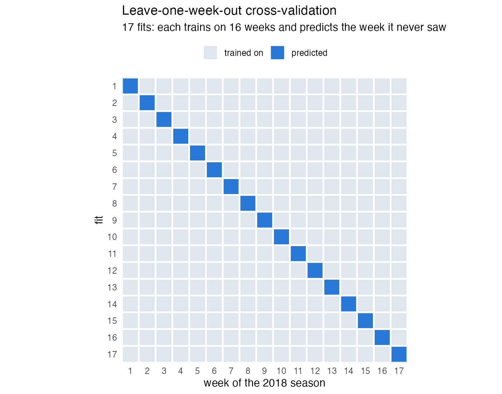
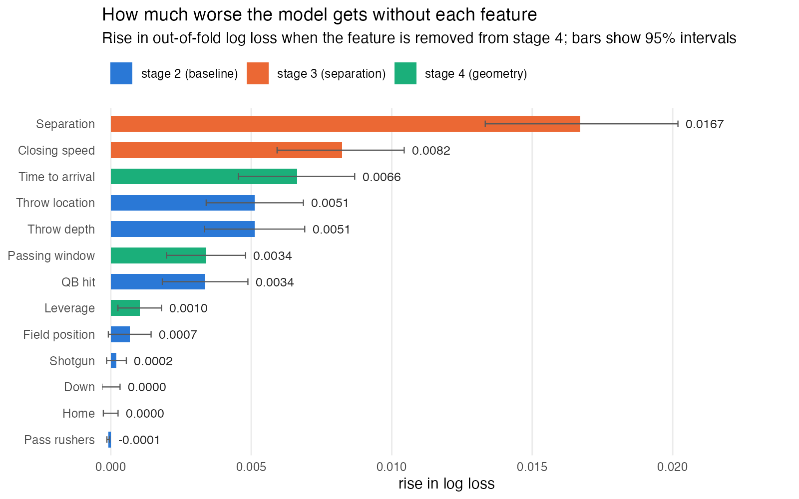
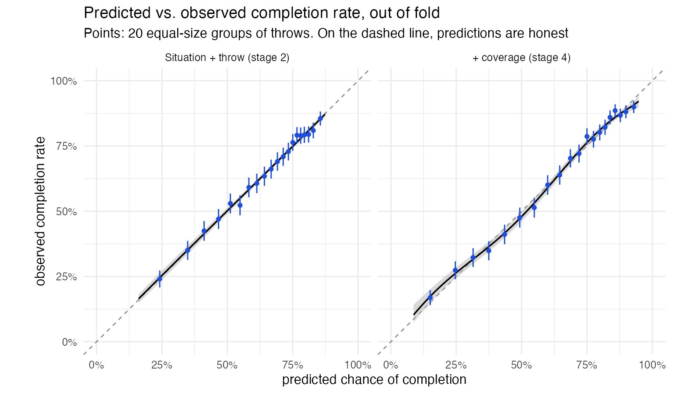
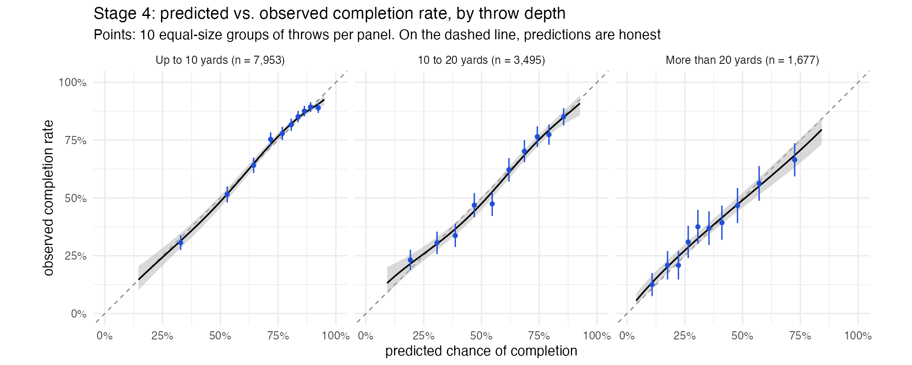

## Final model population

> Does coverage information from player tracking predict completions better
> than play-by-play data at the moment of the throw?

**13,125 passes** · 253 games · all 17 weeks of 2018 · 63.8% completed

| Step | Passes left |
|---|---|
| Clean tracking sample | 17,081 |
| Thrown to a named receiver | 16,668 |
| Receiver tracked, ball's arrival measured | 16,640 |
| Ball arrives past the line of scrimmage | 13,147 |
| Every feature measurable | **13,125** |

::: {.notes}
13,125 pass plays in the final sample. Passes behind the LOS are left out,
as they have fundamental differences from downfield passes, and should be
handled differently.
:::

## Model Features {.tighter}

Each stage keeps everything from the one before and adds a layer. Stage 1
always guesses the average, 63.8%.

:::: {.columns}

::: {.column width="36%"}
**Stage 2 | play-by-play**

- **Depth:** how far downfield the ball arrives
- **Distance to the sticks**
- **Situation:** down, field position, shotgun, home
- **Pressure:** pass rushers, QB hit
- **Location:** middle of the field (y/n), receiver's distance to the sideline
:::

::: {.column width="32%"}
**Stage 3 | + separation**

- **Separation:** yards to the nearest defender
- **Closing speed:** is that defender gaining?
- **Separation × depth:** matters less on long throws
:::

::: {.column width="32%"}
**Stage 4 | + geometry**

- **Leverage:** over the top, underneath, inside, or outside
- **Time to arrival:** can that defender reach the catch point first?
- **Passing window:** can anyone else get into the ball's path?
:::

::::

::: {.notes}
Stage 2 is mostly what public models like nflverse `cp` use, plus two features
they don't have: the number of pass rushers (charted) and the receiver's
distance to the sideline (tracking). That makes the baseline stronger, so the
gain from stages 3–4 is, if anything, understated. Stages 3–4 are coverage
information from tracking, measured at the moment of release.

Stage 3 is "how open is the receiver" 
Stage 4 is "who can get there in time." 

For pass location, I ended up using a combination of a binary variable for whether
the pass was in the middle of the field or not, along with the receiver's distance
to the sideline.
:::

## The Stage 4 Model {.tighter}

A **generalized additive model**: logistic regression where each numeric
feature gets a flexible curve instead of a straight line.

$$
\log \frac{p}{1 - p} = \beta_0 + \underbrace{\textstyle\sum_k \beta_k z_k}_{\text{categorical features}} + \underbrace{\textstyle\sum_j f_j(x_j)}_{\text{a curve per numeric feature}}
$$

```r
library(mgcv)

fit <- gam(
  complete ~
    s(depth_arr) + s(dist_to_sticks) + s(los_x) + s(number_of_pass_rushers, k = 5) +
    s(depth_arr, by = qb_hit) + down + pass_middle + s(sideline_rec) + shotgun + home +
    s(sep_throw) + s(closing_throw) + ti(sep_throw, depth_arr) +           # stage 3
    s(lev_angle, bs = "cc", k = 8) + s(tta_nearest) + s(window_margin),    # stage 4
  family = binomial, method = "REML",
  knots = list(lev_angle = c(-pi, pi)), data = model_frame
)
predict(fit, newdata = new_throws, type = "response")   # probabilities
```


::: {.notes}
4 categorical features: down, pass_middle, shotgun, home

12 numeric features each get a curve. The data choose each curve's shape; 
REML keeps the curves from getting too wiggly.

Leverage is an angle, so its curve wraps around (bs = "cc"). 
:::

## Leave-one-week-out CV {.tighter}

:::: {.columns}

::: {.column width="65%"}

:::

::: {.column width="35%"}
- Fit on 16 weeks, predict the 17th; repeat 17 times
:::

::::

::: {.notes}
- Every pass gets exactly **one** prediction, from a model that never saw its
  week
- All 13,125 predictions are scored together
- **Why weeks, not random plays?** Plays from the same game share a
  quarterback, a defense, and conditions. A random split lets the model peek
  at the game it is predicting, and the score looks better than it is
:::

## How well it predicts {.tighter}

| Model | Log loss | Error removed |
|:---|---:|---:|
| Stage 1: always guess 63.8% | 0.655 | — |
| Stage 2: situation + throw | 0.595 | 9.2% |
| nflverse `cp` (public benchmark) | 0.590 | 9.9% |
| Stage 3: + separation | 0.550 | 15.9% |
| **Stage 4: + geometry** | **0.539** | **17.7%** |

- **Error removed:** how much lower the log loss ("average surprise") is than
  always guessing 63.8%. The baseline removes 9.2%; adding coverage nearly
  doubles it

::: {.notes}
The one number: 9% to 18%. Log loss: 0.655 guessing the average, 0.595
stage 2, 0.539 stage 4. cp has a head start (it was partly trained on
2018) and stage 2 nearly matches it anyway. The claim is "coverage information
adds to what the situation and the throw already tell you," not "we beat
cp." Separation is the biggest single piece.

- Stage 4 vs stage 2: 95% interval [0.050, 0.062] in log loss (resampling
  whole games); holds across 7 robustness checks
:::

## Which features matter most {.tighter}

{width="85%"}

::: {.notes}
Each bar: refit the full model without that feature, predict out of fold
again, and measure how much worse the log loss gets. Bigger bar = the model
leans on it more, *given everything else it has*.

- The top three are all tracking: separation (0.0167), closing speed (0.0082),
  time to arrival (0.0066)
- Then where the throw goes: location and depth (0.0051 each), passing window
  and QB hit (0.0034 each)
- Every tracking feature's interval stays above zero; leverage is the weakest
  (0.0010)
- Down, home, shotgun, field position, and pass rushers add almost nothing
  once the rest is in the model (intervals include zero). That doesn't mean
  they're useless alone: what they know is already covered by other features
:::

## Are the probabilities honest? {.tighter}

{width="78%"}

- **Calibrated:** when stage 4 says 30%, about 30% of those passes are caught
- **More decisive:** stage 4 makes a confident call (below 40% or above 80%) on
  **52%** of throws, against 27% for stage 2, and those calls hold up: 28% and
  87% caught
- **One soft spot:** on throws of 20+ yards it is slightly overconfident.
  Reported, not tuned away

::: {.notes}
Points on the dashed line mean the probabilities can be taken at face value.
The right panel's points spread further toward the corners: tracking lets the
model commit. Deep-throw slope is 0.86 (1 is perfect); correcting it on the
same data it's scored on would be cheating.
:::

## Calibration by throw depth {.tighter}

{width="100%"}

::: {.notes}
Same check as the last slide, split by how far downfield the ball arrives.
Short and intermediate throws sit on the line (slopes 1.01 and 0.99, where 1
is perfect). On throws of more than 20 yards the slope is 0.86 [0.74, 0.985]:
the model is a little too confident there, in both directions. That is the
soft spot from the last slide; it is reported rather than tuned away, because
correcting it on the same data it's scored on would be cheating.

The buckets are up to 10 yards, 10 to 20, and more than 20.
:::
